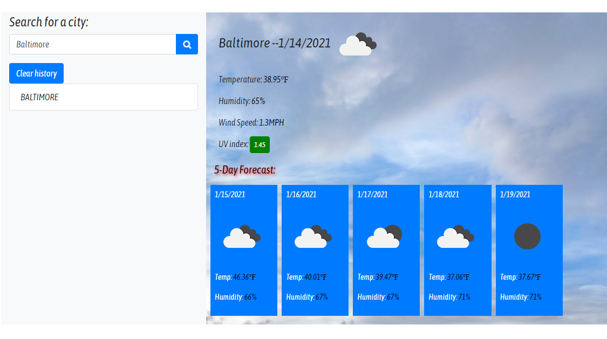
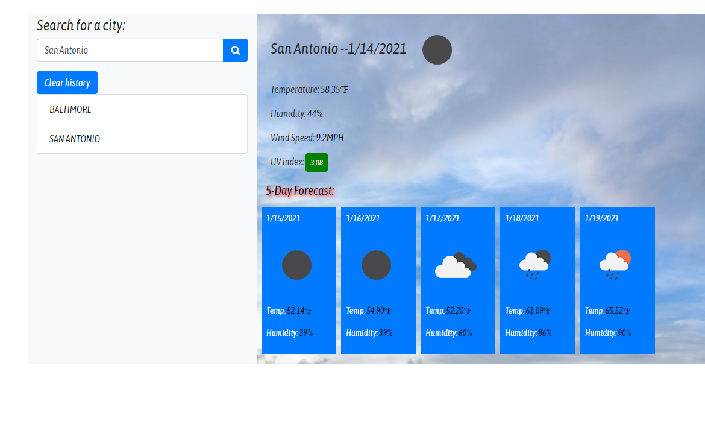

# HW6WeatherApp
5 Day Weather Forcast - Deployed Application "https://leskbook.github.io/HW6WeatherApp/"

**Assignment Objective:**

Using a combination of HTML, CSS, javascript and API this task is meant to present a user with an interactive weather dashboard. The user is presented with an option to search for a city. That search will return the city and display the current weather and a five day forcast for that city. The city is recorded in local storage and a list of cities will populate, allowing the user to click from city to city. The uvi will also be displayed dynamically depending on a preset function. There is also an option to clear the local storage, removing the historical weather.

**Acceptance Criteria**  

- GIVEN a weather dashboard with form inputs
- WHEN I search for a city
- THEN I am presented with current and future conditions for that city and that city is added to the search history
- WHEN I view current weather conditions for that city
- THEN I am presented with the city name, the date, an icon representation of weather conditions, the temperature, the humidity, the wind speed, and the UV index
- WHEN I view the UV index
- THEN I am presented with a color that indicates whether the conditions are favorable, moderate, or severe
- WHEN I view future weather conditions for that city
- THEN I am presented with a 5-day forecast that displays the date, an icon representation of weather conditions, the temperature, and the humidity
- WHEN I click on a city in the search history
- THEN I am again presented with current and future conditions for that city
- WHEN I open the weather dashboard
- THEN I am presented with the last searched city forecast

**Code Snippet**
 - Search option

 

- The city search is saved to local storage so the user can click between cities retaining weather history

- We can clear the local storage as well

